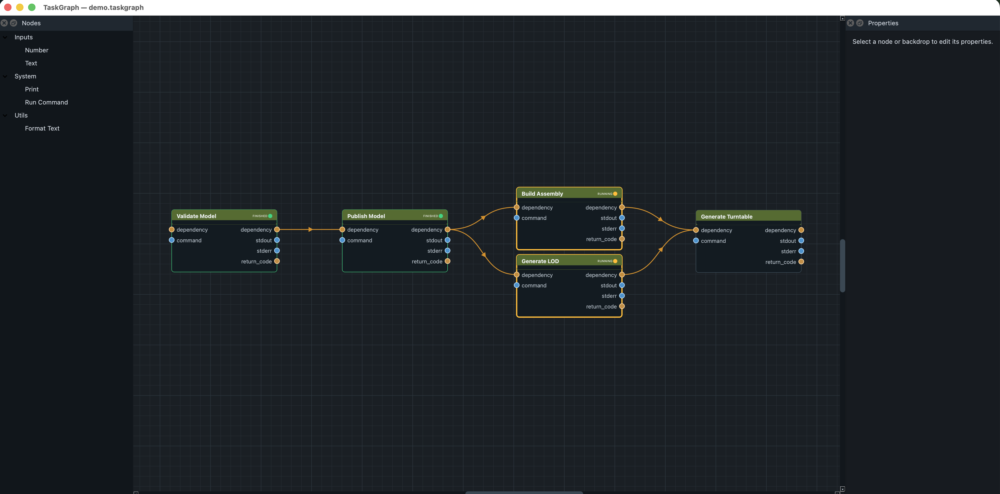

<p align="left">
  <a href="https://buymeacoffee.com/cgarjun">
    
  </a>
</p>

# Koode TaskGraph

TaskGraph is a small, extensible process graph editor built from scratch with
Python, QtPy, and PySide6.



## Run

```bash
python -m venv .venv
source .venv/bin/activate
python -m pip install koode-taskgraph
koode-taskgraph
```

For local development from this repository, use `python -m pip install -e .`.
See [CONTRIBUTING.md](CONTRIBUTING.md) for pull request guidelines.

## Remove local user settings

TaskGraph stores user preferences with Qt `QSettings` under organization
`TaskGraph` and application `TaskGraph`. Settings include saved custom node
locations and the execution worker count. GUI plugin locations are session-only
and are not saved, but older versions may have saved GUI plugin locations.

Default locations:

- **macOS:** `~/Library/Preferences/com.taskgraph.TaskGraph.plist`
- **Linux:** `~/.config/TaskGraph/TaskGraph.conf`
  - If `XDG_CONFIG_HOME` is set:
    `$XDG_CONFIG_HOME/TaskGraph/TaskGraph.conf`
- **Windows:** Registry key
  `HKEY_CURRENT_USER\Software\TaskGraph\TaskGraph`

Quit TaskGraph before removing settings.

macOS:

```bash
defaults delete com.taskgraph.TaskGraph
```

Linux:

```bash
rm ~/.config/TaskGraph/TaskGraph.conf
```

Windows Command Prompt:

```bat
reg delete HKCU\Software\TaskGraph\TaskGraph /f
```

Windows PowerShell:

```powershell
Remove-Item -Path "HKCU:\Software\TaskGraph\TaskGraph" -Recurse -Force
```

## Headless CLI

Execute a saved graph without starting Qt or opening a window:

```bash
koode-taskgraph-cli --file /path/to/workflow.taskgraph
```

Select the worker count and load external node locations when needed:

```bash
koode-taskgraph-cli \
  --file /path/to/workflow.taskgraph \
  --workers 8 \
  --node-path /path/to/custom_nodes
```

`--node-path` may be repeated. `TASKGRAPH_CUSTOM_NODES` is also supported with
the normal platform path separator. Use `--json` for structured results,
`--quiet` to hide progress messages, and `Ctrl+C` to cancel execution.

Exit codes are `0` for success, `1` for graph execution failure, `2` for
arguments/loading errors, and `130` for cancellation.

Double-click a node type in the left panel to add it. Drag from an output port
on the right of a node to an input port on the left of another node. Select a
node to edit its properties, then click **Run graph**.

## Add a node

Create a module in `taskgraph/nodes/` and define a `ProcessNode` subclass:

```python
from taskgraph.core.model import NodeProperty, PortSpec, ProcessNode
from taskgraph.core.registry import register_node

@register_node
class PrefixText(ProcessNode):
    type_id = "custom.prefix_text"
    title = "Prefix Text"
    category = "Custom"
    inputs = (PortSpec("value", "any"),)
    outputs = (PortSpec("text", "text"),)
    properties = (
        NodeProperty("prefix", "Prefix", "text", "Result: "),
    )

    def process(self, inputs):
        return {"text": f"{self.prefix}{inputs.get('value', '')}"}
```

Property kinds map to generated controls in the Properties panel: `"text"` for
a line edit, `"file"` for a file path field with a Browse button, `"bool"` for
a checkbox, `"int"`/`"float"` for numeric fields, and `"choice"` for a
dropdown using `choices`.

Modules in `taskgraph/nodes/` are discovered automatically. Custom modules can
also live anywhere on disk:

1. Put one or more standalone `.py` node modules in a directory.
2. Select **Nodes → Add Custom Node Location…** and choose that directory.
3. Restarting TaskGraph reloads the saved location automatically.

Alternatively, set `TASKGRAPH_CUSTOM_NODES` before launching. Separate multiple
directories with the platform path separator (`:` on macOS/Linux and `;` on
Windows):

```bash
TASKGRAPH_CUSTOM_NODES="/path/to/company_nodes:/path/to/my_nodes" koode-taskgraph
```

Files beginning with `_` are ignored. Importing a custom node module executes
its Python code, so only add trusted directories. The editor, property panel,
serialization, and executor require no other changes.

This repository includes a practical custom node example in
`examples/custom_nodes/text_cleanup.py`. Load `examples/custom_nodes` from
**Nodes → Add Custom Node Location…** or with:

```bash
TASKGRAPH_CUSTOM_NODES="/path/to/taskgraph/examples/custom_nodes" koode-taskgraph
```

The example adds **Examples → Clean Text**, which trims text, optionally
collapses whitespace, and applies a selectable case conversion.

## Add a GUI plugin

GUI plugins can add menus, commands, docks, and graph-building tools without
editing TaskGraph source. Put one or more `.py` files in a plugin directory and
define `class Plugin(TaskGraphGuiPlugin)`.

The plugin API is split into namespaces. Inside `TaskGraphGuiPlugin` subclasses
these are available as:

- `self.commands` registers reusable commands.
- `self.ui` exposes GUI features such as menus, docks, and status messages.
- `self.graph` creates nodes, connects ports, reads the graph model, and adds
  backdrops.

```python
from taskgraph.ui.plugins import TaskGraphGuiPlugin


class Plugin(TaskGraphGuiPlugin):
    plugin_id = "example.graph_daily_report"
    name = "Daily Report Graph Builder"
    version = "1.0.0"

    def setup(self):
        self.commands.register(
            f"{self.plugin_id}.build_daily_report",
            label="Graph API: Build Daily Report Graph",
            callback=self.build_daily_report,
        )
        self.ui.menus.add_command(
            "Examples",
            f"{self.plugin_id}.build_daily_report",
        )

    def build_daily_report(self):
        text = self.graph.create_node(
            "input.text",
            name="Report Title",
            values={"text": "Daily Production Report"},
            position=(0, 0),
        )
        printer = self.graph.create_node(
            "output.print",
            name="Print Report",
            position=(320, 0),
        )
        self.graph.connect_dependency(text, printer)
        self.graph.connect_attribute(text, "text", printer, "value")
        self.graph.add_backdrop(
            title="Daily Report Template",
            note="This graph was created by a GUI plugin.",
            position=(-40, -140),
            size=(650, 170),
        )
```

Older flat helpers such as `api.create_node(...)` and
`api.add_menu_action(...)`, plus the old `register_taskgraph_plugin(api)`
function entrypoint, are still supported for compatibility. New plugins should
use the OOP `Plugin` class and namespaced API.

Load GUI plugins from **Plugins → Add GUI Plugin Location…** for the current
session. GUI plugin locations are not saved or automatically reloaded on the
next launch. To load GUI plugins at startup, set `TASKGRAPH_GUI_PLUGINS` before
launching, using the same platform path separator rules as
`TASKGRAPH_CUSTOM_NODES`.

This repository includes separate practical example plugins in
`examples/gui_plugins`:

- `ui_project_notes.py` demonstrates the UI API by opening a Project Notes dock
  panel and writing a status message.
- `command_validate_graph.py` demonstrates the command API by registering a
  reusable graph validation command and exposing it in the menu.
- `graph_daily_report.py` demonstrates the graph API by building a reusable
  daily-report graph with nodes, dependency links, attribute links, and a
  backdrop.

Load that directory, then use the **Examples** menu to run each example.

GUI plugins are intentionally separate from custom node locations. The
headless CLI loads `TASKGRAPH_CUSTOM_NODES` only, so UI plugin code can safely
import Qt widgets without breaking `koode-taskgraph-cli`.

## Controls

- Standard commands are organized under the **File**, **Edit**, **Nodes**,
  **Graph**, **Plugins**, and **View** menus.
- Use the search field at the top of the **Nodes** panel to filter nodes by
  title, type id, or category.
- Drag a node from **Nodes** to the canvas, or double-click it.
- Every node has fixed gold **dependency** input/output ports. These control
  process order but do not transfer values. Gold dependency connections show
  an arrowhead pointing from the upstream node toward the downstream node.
- Declared node inputs and outputs are attribute ports. Attribute connections
  transfer values, but execution order comes only from dependency connections.
  An attribute connection therefore needs a dependency path from its source
  node to its target node.
- Dependency ports connect only to dependency ports; compatible attribute
  ports connect only to attribute ports.
- Select one or more nodes on the canvas and press **D** to toggle them
  disabled. Disabled nodes stay in the dependency chain but their process
  functions are skipped. The same command is available from **Edit**.
- **Copy Nodes** and **Paste Nodes** under **Edit** use the standard platform
  shortcuts. Properties, disabled state, relative positions, and connections
  entirely inside the copied selection are preserved.
- Select a node to edit generated property controls.
- Use **Node Name** at the top of the Properties panel to give each node
  instance a descriptive name. Custom names appear in node headers and
  execution messages and are preserved when saving or copying nodes.
- Select nodes or connections and press **Backspace** or **Delete** to remove
  them. **Edit → Delete Selected** works on every platform too.
- Middle-drag pans, the mouse wheel zooms, and **F** frames the graph.
- **Shift+A** or **Graph → Auto Arrange Nodes** lays out dependency layers
  from left to right and parallel nodes vertically, then frames the result.
- **Graph → Add Backdrop** creates a movable notes region behind the graph.
  Select it to edit its title, notes, color, width, and height in Properties.
  Drag the grip in its bottom-right corner to resize it interactively.
  Backdrops are stored in `.taskgraph` files.
- **Ctrl+R** executes nodes in dependency order.
- Independent dependency branches execute concurrently. Choose between one
  worker or any even worker count from 2 through 32 under
  **Graph → Worker Count**; the setting is remembered.
- Use **Graph → Cancel Execution** or **Esc** to cancel the complete run.
  Pending nodes are cancelled immediately. Running nodes receive a cooperative
  cancellation signal, and built-in command nodes terminate their subprocess
  groups promptly.
- Clear displayed execution messages with **Graph → Clear Execution Log** or
  from the Execution panel's right-click menu.
- Built-in nodes are organized as **System → Run Command/Print**,
  **Utils → Format Text**, and **Inputs → Text/Number**.
- The built-in **System → Run Command** node executes a command and exposes
  stdout, stderr, and return code outputs. It supports an optional working
  directory, shell mode, timeout, and failure on non-zero exit. Shell mode
  executes exactly what the graph author enters, so only run trusted graphs.
- The built-in **Utils → Format Text** node accepts multiple connections into
  its `value` input. Use positional placeholders such as `{0}`, `{1}`, and
  `{2}` in the template. `{value}` remains available as the first input value
  for simple one-input templates. Connections into multi-input attribute ports
  show index labels on the wire so the template order is visible on the graph.
- Node headers show live execution state: amber while running, green when
  finished, red on failure, gray when a disabled node is skipped, and muted
  red when a node is blocked by an upstream failure. Cancelled nodes use a
  purple-gray state.
  Execution coordination runs outside the GUI thread so the final running
  node and parallel running nodes remain visible while work is in progress.
- A failed node blocks only its downstream dependency branch. Independent
  parallel branches continue running and report their own final states.
- Closed panels can be restored from **View → Nodes/Properties/Execution**.
  Use **View → Show All Panels** to restore everything at once.

Graph files use readable JSON with the `.taskgraph` extension.

## Architecture

- `core/model.py`: node contract—including inherited dependency port
  specifications—and serializable graph model
- `core/registry.py`: decorator-based built-in and external node discovery
- `core/executor.py`: validation and dependency-ordered execution
- `ui/`: graphics editor, node items, property editor, and main window
- `nodes/`: built-in examples and the extension point for new processes
